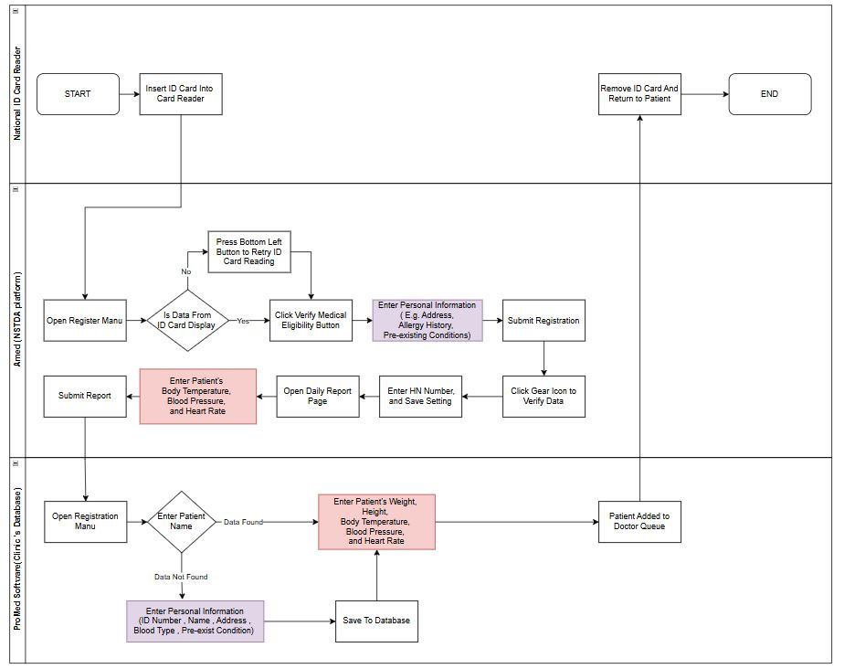
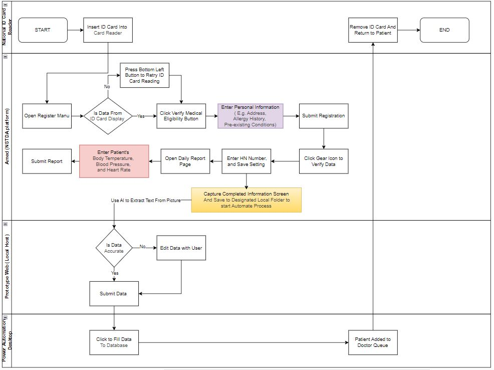

# RepidRag - Optimization Of Medical Documentation Process

## Project Overview and Background

This project is being developed in collaboration with Dr. Boom Clinic, a General Internal Medicine Clinic located in Surat Thani, Thailand. **The primary goal of the project is to improve the efficiency of the registration and medical history documentation process**, which is currently repetitive and time-consuming. By optimizing these processes, the clinic can enhance workflow efficiency, reduce administrative burdens, and improve overall patient experience.

The main issue of this project revolves around the "One ID Card Smart Hospital" initiative, also known as the "30 บาทรักษาทุกที่" program. When clients use this medical welfare service (which most clients do), the clinic must complete the registration and medical history documentation process for reimbursement in the NSTDA platform.

Currently, the clinic uses a separate program as a database for client records, medicine storage, and appointment scheduling. **This means that for each client using the medical welfare service, clinic staff must manually enter data into two systems, one in the clinic's database and another in the NSTDA platform.**

This duplication significantly increases workload and takes up valuable time, leading to repetitive tasks that divert medical personnel from their primary responsibilities. The inefficiency not only affects staff productivity but also impacts on the overall patient experience.

You can find more details about this project in these documents.
- [Business Requirement Document](RapidReg_BRD.docx)
- [Business Case](RepidReg_BusinessCase.docx)

## Business Process Flow

### As Is Diagram

### To be Diagram , Prof-Of-Concept 1 (POC1)

POC1 **raises concerns regarding data security and compliance with Thailand’s PDPA policy**, as it currently uses the OpenAI API to extract data. Therefore, **in the next version of the prototype, the development team aims to implement a local ML model** for data extraction to enhance security and ensure compliance with data protection regulations.